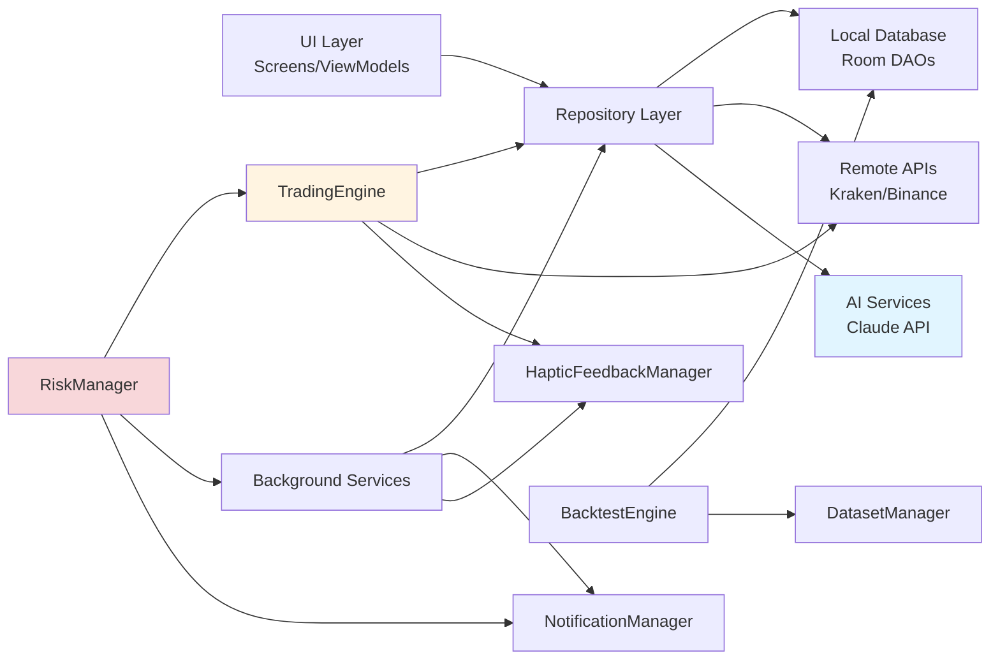
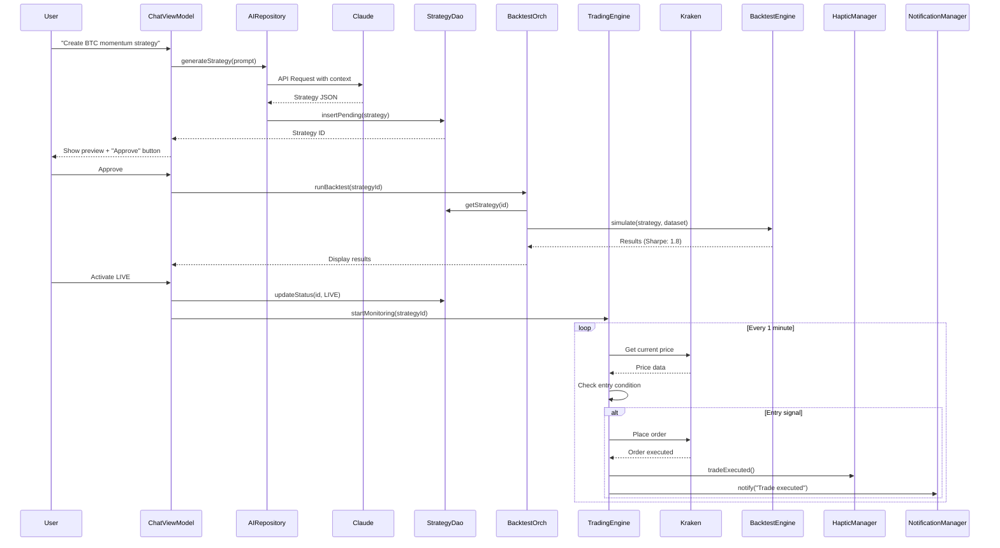
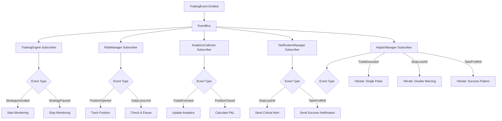
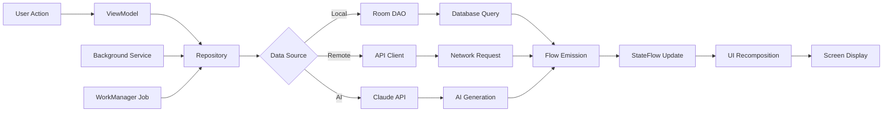
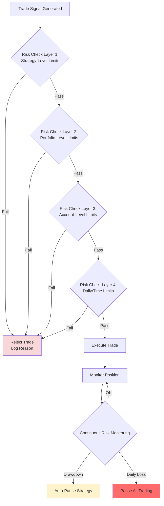
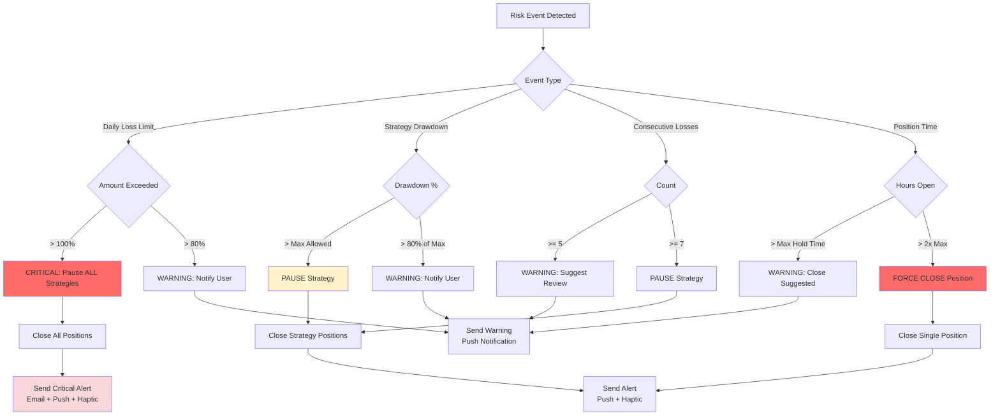

# 🤖 AUTOMATION GUIDE - CryptoTrader

**Purpose:** Complete automation workflows and integration points for AI-driven trading
**Last Updated:** 2025-01-20

---

## 📋 TABLE OF CONTENTS

1. [Automation Philosophy](#automation-philosophy)
2. [Core Automation Workflows](#core-automation-workflows)
3. [Integration Points](#integration-points)
4. [Event-Driven Architecture](#event-driven-architecture)
5. [Data Flow Maps](#data-flow-maps)
6. [Automation Opportunities](#automation-opportunities)
7. [Safety & Risk Management](#safety--risk-management)

---

## 🎯 AUTOMATION PHILOSOPHY

**Goal:** Reduce manual work while maintaining user control and safety.

**Principles:**
1. **User Consent** - No critical actions without explicit approval
2. **Transparency** - All automated actions logged and visible
3. **Safety First** - Risk limits always enforced
4. **Fail Safe** - Errors pause automation, don't cascade
5. **Gradual Trust** - Start conservative, scale with proven performance

---

## 🔄 CORE AUTOMATION WORKFLOWS

### 1. AI STRATEGY GENERATION → AUTO-DEPLOYMENT

**Description:** User describes strategy in natural language → AI generates → Auto-backtest → User approves → Live trading

```mermaid
graph TD
    A[User: "Create momentum strategy for BTC"] --> B[ChatViewModel]
    B --> C{Focus Mode Active?}
    C -->|Yes| D[Hide dollar amounts in UI]
    C -->|No| E[Show full amounts]

    D --> F[AIAdvisorRepository.generateStrategy]
    E --> F

    F --> G[Claude API Call]
    G --> H[Strategy Object Returned]

    H --> I[Parse Parameters:<br/>- Entry: RSI < 30<br/>- Exit: RSI > 70<br/>- Stop Loss: 2%<br/>- Take Profit: 5%]

    I --> J[StrategyDao.insertPending]
    J --> K[Strategy Tab 3: Pending Strategies]

    K --> L{User Reviews}
    L -->|Reject| M[Delete from DB]
    L -->|Edit| N[Open Create Manual Screen<br/>with pre-filled params]
    L -->|Approve| O[Auto-Backtest Trigger]

    O --> P[BacktestOrchestrator.runBacktest]
    P --> Q[Load Historical Data<br/>from DatasetManager]
    Q --> R[BacktestEngine.simulate]

    R --> S[Results:<br/>Sharpe: 1.8<br/>Win Rate: 65%<br/>Max DD: 12%]

    S --> T{Performance Check}
    T -->|Sharpe < 1.0| U[Warning: Poor Performance]
    T -->|Sharpe >= 1.0| V[Results Displayed in Test Center]

    U --> W{User Decision}
    V --> W

    W -->|Activate Paper| X[Set Mode: PAPER<br/>Start Virtual Trading]
    W -->|Activate Live| Y{Risk Confirmation}
    W -->|Cancel| Z[Keep as Backtest-Only]

    Y -->|Confirmed| AA[Set Mode: LIVE<br/>HapticFeedback.success<br/>Start Real Trading]
    Y -->|Declined| X

    AA --> AB[TradingEngine Monitors Signals]
    AB --> AC{Entry Condition Met?}
    AC -->|Yes| AD[Place Order<br/>HapticFeedback.tradeExecuted]
    AC -->|No| AB

    AD --> AE[Position Monitoring]
    AE --> AF{Exit Condition Met?}
    AF -->|Stop Loss| AG[Close Position<br/>HapticFeedback.stopLossHit<br/>Log Trade]
    AF -->|Take Profit| AH[Close Position<br/>HapticFeedback.takeProfitHit<br/>Log Trade]
    AF -->|No| AE

    AG --> AI[Update Analytics]
    AH --> AI
    AI --> AB

    style G fill:#e1f5ff
    style O fill:#fff4e1
    style AA fill:#d4edda
    style AG fill:#f8d7da
    style AH fill:#d4edda
```

**Components Involved:**
- `ChatViewModel` - User interaction
- `AIAdvisorRepository` - Claude API integration
- `StrategyDao` - Database storage
- `StrategyViewModel` - State management
- `BacktestOrchestrator` - Auto-backtest trigger
- `BacktestEngine` - Simulation execution
- `TradingEngine` - Live execution
- `HapticFeedbackManager` - Tactile feedback

**Automation Triggers:**
- User sends chat message → AI generation
- User approves strategy → Auto-backtest
- Backtest completes → Results display
- Strategy activated LIVE → Order monitoring
- Entry signal detected → Auto-place order (if enabled)
- Exit signal detected → Auto-close position (if enabled)

**Safety Mechanisms:**
- User approval required for LIVE mode
- Risk confirmation dialog for high-risk strategies
- Daily loss limit enforced
- Max concurrent positions enforced
- Drawdown monitoring → Auto-pause if exceeded

---

### 2. EXPERT REPORTS → AI ANALYSIS → STRATEGY ENHANCEMENT

**Description:** Markdown reports scanned → AI extracts insights → Suggests strategy improvements

```mermaid
graph TD
    A[File System Monitor] --> B{New .md File Detected?}
    B -->|Yes| C[ReportsRepository.scanForNewReports]
    B -->|No| A

    C --> D[Parse Markdown]
    D --> E[Extract Metadata:<br/>- Title<br/>- Author<br/>- Date<br/>- Assets mentioned]

    E --> F[ExpertReportDao.insert]
    F --> G[Strategy Tab 5: Reports Library<br/>Show Unanalyzed Badge]

    G --> H{User: "Analyze Reports"}
    H --> I[MetaAnalysisRepository.analyzeReports]

    I --> J[Claude API: Summarize Insights]
    J --> K[Extract Trading Signals:<br/>- Bullish on BTC<br/>- Bearish on ETH<br/>- Volatility warning]

    K --> L[Store Analysis Results]
    L --> M[Mark Report as Analyzed]

    M --> N[Strategy Tab 6: AI Insights<br/>Display Analysis]

    N --> O{User: "Apply to Strategy"}
    O --> P[Load Existing Strategy]
    P --> Q[Suggest Parameter Adjustments:<br/>- Increase BTC allocation<br/>- Add volatility filter<br/>- Tighten stop-loss]

    Q --> R{User Accepts Changes?}
    R -->|Yes| S[Update Strategy Parameters]
    R -->|No| T[Discard Suggestions]

    S --> U[Auto-Backtest with New Params]
    U --> V[Compare Results:<br/>Old Sharpe vs New Sharpe]

    V --> W{Improvement?}
    W -->|Yes| X[Save Updated Strategy<br/>Notify User]
    W -->|No| Y[Revert to Original<br/>Log Failed Optimization]

    style J fill:#e1f5ff
    style U fill:#fff4e1
    style X fill:#d4edda
    style Y fill:#f8d7da
```

**Components Involved:**
- `FileSystemMonitor` (via Android WorkManager)
- `ReportsRepository` - File scanning
- `ExpertReportDao` - Report storage
- `MetaAnalysisRepository` - AI analysis
- `StrategyViewModel` - Strategy updates
- `BacktestOrchestrator` - Performance validation

**Automation Triggers:**
- New file in ExpertReports folder → Scan
- User taps "Analyze Reports" → Batch analysis
- Analysis completes → Badge update
- User applies suggestions → Auto-backtest
- Backtest shows improvement → Auto-save

---

### 3. MARKET EVENT → AI ANALYSIS → SIGNAL GENERATION

**Description:** Market moves detected → AI analyzes context → Trading signals generated

```mermaid
graph TD
    A[Market Data Stream<br/>WebSocket] --> B[Price Update Received]

    B --> C{Significant Movement?}
    C -->|> 5% in 1h| D[Event Detected]
    C -->|Normal| A

    D --> E[Store Market Snapshot]
    E --> F[AIAdvisorRepository.analyzeMarketEvent]

    F --> G[Claude API with Context:<br/>- Current positions<br/>- Active strategies<br/>- Recent reports<br/>- Portfolio risk]

    G --> H[AI Analysis:<br/>- Sentiment: BEARISH<br/>- Confidence: 85%<br/>- Risk: HIGH<br/>- Recommendation: Close long positions]

    H --> I[Store AI Analysis]
    I --> J[Strategy Tab 6: AI Insights<br/>Show Latest Analysis]

    J --> K{Auto-Trading Enabled?}
    K -->|No| L[Notification Only<br/>User Reviews Manually]
    K -->|Yes| M[Generate Trading Signals]

    M --> N{Signal Type}
    N -->|CLOSE_POSITIONS| O[Close All Long Positions]
    N -->|REDUCE_EXPOSURE| P[Close 50% of Positions]
    N -->|ENTER_HEDGE| Q[Open Short Position]

    O --> R[Execute Trades]
    P --> R
    Q --> R

    R --> S[HapticFeedback.tradeExecuted]
    S --> T[Log Actions to Trade History]
    T --> U[Update Portfolio State]

    U --> V[Send Notification:<br/>"AI auto-closed positions<br/>due to bearish signal"]

    style G fill:#e1f5ff
    style M fill:#fff4e1
    style R fill:#ffe1e1
    style V fill:#d4edda
```

**Components Involved:**
- `MarketDataRepository` - WebSocket stream
- `EventDetectionService` - Movement analysis
- `AIAdvisorRepository` - Context-aware analysis
- `TradingEngine` - Order execution
- `NotificationManager` - User alerts

**Automation Triggers:**
- Price movement > threshold → Event detection
- Event detected → AI analysis
- Analysis confidence > 80% + auto-trade enabled → Execute
- Trade executed → Notification
- User disables auto-trade → Switch to notification-only

**Safety Mechanisms:**
- User must enable auto-trading explicitly
- Confidence threshold required (default 80%)
- Max positions to close in one event (default 50%)
- Daily action limit (max 5 auto-trades)
- User can disable per-strategy

---

### 4. PERFORMANCE MONITORING → RISK DETECTION → AUTO-PAUSE

**Description:** Strategy performance tracked → Risk limits breached → Auto-pause for safety

```mermaid
graph TD
    A[Active Strategy Running] --> B[Position Opened]
    B --> C[Start Monitoring]

    C --> D[Track Metrics:<br/>- Unrealized P&L<br/>- Drawdown from peak<br/>- Time in position<br/>- Win streak/loss streak]

    D --> E{Risk Check}

    E -->|Drawdown > Max| F[RISK: Max Drawdown Exceeded<br/>Current: 15%, Limit: 10%]
    E -->|Daily Loss > Limit| G[RISK: Daily Loss Limit Hit<br/>Lost: $500, Limit: $400]
    E -->|Consecutive Losses| H[RISK: 5 Losses in a Row]
    E -->|Position Time > Max| I[WARNING: Position Open 48h<br/>Max: 24h]
    E -->|All Good| D

    F --> J{Auto-Pause Enabled?}
    G --> J
    H --> J

    J -->|Yes| K[Pause Strategy]
    J -->|No| L[Notification Only]

    K --> M[Close Open Positions<br/>HapticFeedback.stopLossHit]
    M --> N[Set Status: PAUSED]
    N --> O[Log Pause Reason]

    O --> P[Send Critical Notification:<br/>"Strategy XYZ auto-paused<br/>Reason: Max drawdown exceeded"]

    P --> Q[Update Strategy UI:<br/>Show PAUSED badge<br/>Display reason]

    I --> R[Send Warning Notification<br/>NOT auto-paused]

    L --> S[Send Warning Notification]

    style F fill:#f8d7da
    style G fill:#f8d7da
    style H fill:#f8d7da
    style K fill:#fff3cd
    style P fill:#d4edda
```

**Components Involved:**
- `PerformanceMonitor` (background service)
- `RiskManager` - Limit enforcement
- `TradingEngine` - Position closing
- `StrategyViewModel` - Status updates
- `NotificationManager` - Critical alerts

**Automation Triggers:**
- Position P&L update → Risk check
- Daily loss calculated → Limit check
- Strategy paused → Close positions + notify
- User re-enables → Resume monitoring

**Safety Mechanisms:**
- Auto-pause default ON (user can disable per-strategy)
- Multiple risk triggers (drawdown, daily loss, consecutive losses)
- Critical notifications cannot be dismissed without acknowledgement
- Audit log of all auto-pause events
- User must manually re-activate paused strategies (prevents automatic resume)

---

### 5. DAILY PERFORMANCE REPORT → OPTIMIZATION SUGGESTIONS

**Description:** Daily job analyzes all strategies → Suggests optimizations → User reviews

```mermaid
graph TD
    A[Daily Job Trigger<br/>2 AM Local Time] --> B[AnalyticsRepository.generateDailyReport]

    B --> C[Collect Data:<br/>- All trades today<br/>- Strategy performance<br/>- Portfolio changes<br/>- Market conditions]

    C --> D[Calculate Metrics:<br/>- Total P&L<br/>- Win rate<br/>- Sharpe ratio<br/>- Best/worst trades]

    D --> E[Analyze Strategy Performance]
    E --> F{Any Strategy Underperforming?}

    F -->|Yes| G[Identify Issues:<br/>- Win rate dropped 20%<br/>- Consecutive losses<br/>- Low profit factor]
    F -->|No| H[All Strategies OK]

    G --> I[AIAdvisorRepository.suggestOptimizations]
    I --> J[Claude API: Analyze Strategy<br/>with Context:<br/>- Recent trades<br/>- Market conditions<br/>- Original parameters]

    J --> K[Suggestions:<br/>1. Tighten stop-loss 2% → 1.5%<br/>2. Add volume filter<br/>3. Avoid trading during high volatility]

    K --> L[Store Suggestions]
    L --> M[Generate Report PDF]

    H --> M

    M --> N[Send Notification:<br/>"Daily report ready"]
    N --> O[Email Report<br/>if enabled]

    O --> P{User Opens App}
    P --> Q[Home Screen:<br/>Show Report Card]

    Q --> R{User: "View Suggestions"}
    R --> S[Display Optimization Ideas]

    S --> T{User: "Apply Suggestion"}
    T --> U[Update Strategy Parameters]
    U --> V[Auto-Backtest with New Params]

    V --> W{Better Performance?}
    W -->|Yes| X[Save Updated Strategy]
    W -->|No| Y[Revert Changes]

    style J fill:#e1f5ff
    style V fill:#fff4e1
    style X fill:#d4edda
    style Y fill:#f8d7da
```

**Components Involved:**
- `DailyReportWorker` (Android WorkManager)
- `AnalyticsRepository` - Data aggregation
- `AIAdvisorRepository` - Optimization suggestions
- `BacktestOrchestrator` - Validation
- `NotificationManager` - Alerts
- `EmailService` - Optional email delivery

**Automation Triggers:**
- 2 AM daily → Job runs
- Report generated → Notification
- User reviews suggestion → Auto-backtest
- Better performance detected → Save

**Safety Mechanisms:**
- Suggestions never auto-applied (user reviews first)
- Backtest validation required before saving
- Revert option if performance degrades
- Weekly summary includes all changes made

---

## 🔗 INTEGRATION POINTS

### Component Communication Map



### Data Flow: Strategy Creation to Execution



---

## ⚡ EVENT-DRIVEN ARCHITECTURE

### Event Types

```kotlin
sealed class TradingEvent {
    // Strategy events
    data class StrategyCreated(val strategyId: String) : TradingEvent()
    data class StrategyActivated(val strategyId: String, val mode: TradingMode) : TradingEvent()
    data class StrategyPaused(val strategyId: String, val reason: String) : TradingEvent()

    // Trade events
    data class TradeExecuted(val tradeId: String, val pair: String, val type: TradeType) : TradingEvent()
    data class PositionOpened(val positionId: String) : TradingEvent()
    data class PositionClosed(val positionId: String, val pnl: BigDecimal) : TradingEvent()
    data class StopLossHit(val positionId: String) : TradingEvent()
    data class TakeProfitHit(val positionId: String) : TradingEvent()

    // Market events
    data class SignificantPriceMove(val pair: String, val changePercent: Double) : TradingEvent()
    data class VolatilitySpike(val pair: String) : TradingEvent()

    // Risk events
    data class DailyLossLimitApproached(val currentLoss: BigDecimal, val limit: BigDecimal) : TradingEvent()
    data class MaxDrawdownExceeded(val strategyId: String, val drawdown: Double) : TradingEvent()

    // AI events
    data class AIAnalysisCompleted(val analysisId: String) : TradingEvent()
    data class ReportAnalyzed(val reportId: String) : TradingEvent()
}
```

### Event Handling



---

## 📊 DATA FLOW MAPS

### Repository Layer Dependencies

```mermaid
graph TD
    A[StrategyRepository] --> B[StrategyDao]
    A --> C[BacktestEngine]

    D[AIAdvisorRepository] --> E[Claude API Client]
    D --> F[AIMarketAnalysisDao]
    D --> G[AdvisorAnalysisDao]

    H[TradingRepository] --> I[OrderDao]
    H --> J[PositionDao]
    H --> K[TradeDao]
    H --> L[Kraken API Client]
    H --> M[Binance API Client]

    N[AnalyticsRepository] --> K
    N --> J
    N --> O[PortfolioSnapshotDao]

    P[ReportsRepository] --> Q[ExpertReportDao]
    P --> R[MetaAnalysisDao]
    P --> E

    S[MarketDataRepository] --> T[WebSocket Manager]
    S --> U[MarketSnapshotDao]

    style E fill:#e1f5ff
    style L fill:#fff4e1
    style M fill:#fff4e1
```



### State Management Flow



---

## 🚀 AUTOMATION OPPORTUNITIES

### Current Automation Level

| Workflow | Manual | Semi-Auto | Full Auto | Status |
|----------|--------|-----------|-----------|--------|
| Strategy Creation | ✓ | ✓ (AI assist) | ✗ | Phase 1 |
| Backtesting | ✓ | ✓ (auto after AI) | ✗ | Phase 1 |
| Strategy Activation | ✓ | ✗ | ✗ | Phase 1 |
| Trade Execution | ✓ | ✗ | ✓ (if enabled) | Phase 1 |
| Position Monitoring | ✗ | ✗ | ✓ | Phase 1 |
| Risk Management | ✗ | ✓ (warnings) | ✓ (auto-pause) | Phase 1 |
| Report Analysis | ✓ | ✓ (AI assist) | ✗ | Phase 2 |
| Performance Reports | ✗ | ✗ | ✓ (daily) | Phase 2 |
| Parameter Optimization | ✓ | ✓ (suggestions) | ✗ | Phase 3 |

### Future Automation Ideas (Phase 3+)

1. **Auto-Rebalancing**
   - Detect portfolio drift
   - Calculate optimal rebalance trades
   - Execute with user approval

2. **Strategy Cross-Validation**
   - New strategy → Auto-test against all historical datasets
   - Generate confidence score
   - Suggest optimal timeframe

3. **Market Regime Detection**
   - Detect bull/bear/sideways markets
   - Auto-adjust strategy parameters
   - Switch to regime-appropriate strategies

4. **Social Sentiment Integration**
   - Monitor Twitter/Reddit for crypto sentiment
   - Feed into AI analysis
   - Adjust position sizing based on sentiment

5. **Tax Loss Harvesting**
   - Identify losing positions near year-end
   - Suggest tax-efficient closures
   - Auto-generate tax reports

---

## 🛡️ SAFETY & RISK MANAGEMENT

### Risk Enforcement Hierarchy



### Risk Limits Configuration

| Limit Type | Default | User Configurable | Auto-Pause |
|------------|---------|-------------------|------------|
| Max Position Size | 10% portfolio | ✓ | ✗ |
| Max Concurrent Positions | 5 | ✓ | ✗ |
| Daily Loss Limit | $500 or 5% | ✓ | ✓ |
| Strategy Max Drawdown | 15% | ✓ | ✓ |
| Consecutive Losses | 5 | ✓ | ✓ (warning only) |
| Max Leverage | 2x | ✓ | ✗ |
| Order Size vs Volume | <5% daily volume | ✗ | ✗ |

### Auto-Pause Decision Tree



---

## 📝 IMPLEMENTATION CHECKLIST

### Phase 1 (Current)
- [ ] Event bus implementation (Kotlin Flow)
- [ ] TradingEngine with auto-execution
- [ ] RiskManager with auto-pause
- [ ] HapticFeedbackManager
- [ ] Basic notification system
- [ ] AI strategy generation workflow
- [ ] Auto-backtest after AI generation

### Phase 2
- [ ] Daily report generation (WorkManager)
- [ ] Report analysis automation
- [ ] Email delivery service
- [ ] Advanced notification rules
- [ ] Performance optimization suggestions
- [ ] Market event detection

### Phase 3
- [ ] Parameter optimization (genetic algorithm)
- [ ] Auto-rebalancing
- [ ] Market regime detection
- [ ] Social sentiment integration
- [ ] Tax reporting automation

---

## 📚 CODE EXAMPLES

### Subscribing to Trading Events

```kotlin
class MyViewModel @Inject constructor(
    private val eventBus: TradingEventBus
) : ViewModel() {

    init {
        viewModelScope.launch {
            eventBus.events.collect { event ->
                when (event) {
                    is TradingEvent.TradeExecuted -> handleTradeExecuted(event)
                    is TradingEvent.StopLossHit -> handleStopLoss(event)
                    is TradingEvent.StrategyPaused -> handleStrategyPaused(event)
                    else -> {}
                }
            }
        }
    }

    private fun handleTradeExecuted(event: TradingEvent.TradeExecuted) {
        // Update UI, show notification, trigger haptic
        hapticManager.tradeExecuted()
        notificationManager.showTradeNotification(event)
    }
}
```

### Triggering Auto-Backtest

```kotlin
class StrategyViewModel @Inject constructor(
    private val strategyRepository: StrategyRepository,
    private val backtestOrchestrator: BacktestOrchestrator,
    private val eventBus: TradingEventBus
) : ViewModel() {

    fun approveStrategy(strategyId: String) {
        viewModelScope.launch {
            // Update status
            strategyRepository.updateStatus(strategyId, StrategyStatus.APPROVED)

            // Trigger auto-backtest
            val results = backtestOrchestrator.runBacktest(strategyId)

            // Emit event
            eventBus.emit(TradingEvent.BacktestCompleted(strategyId, results))

            // Display results
            _uiState.update { it.copy(backtestResults = results) }
        }
    }
}
```

---

**Last Updated:** 2025-01-20
**Next Review:** After Phase 1 completion
**Maintained By:** Development Team
