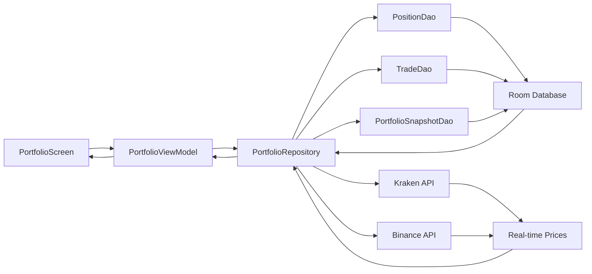

# 📚 FUNCTION SPECIFICATIONS - CryptoTrader

**Purpose:** Detailed specifications for all features and components
**Last Updated:** 2025-01-20

---

## 📱 NAVIGATION SYSTEM

### Bottom Navigation
**File:** `MainActivity.kt:93-144`

**Purpose:** Primary app navigation with 5 main sections

| Item | Route | Icon | Screen | Tabs |
|------|-------|------|--------|------|
| Home | `dashboard` | Dashboard | DashboardScreen | N/A |
| Portfolio | `portfolio` | PieChart | PortfolioScreen | 6 tabs |
| Strategy | `strategy` | AutoAwesome | StrategyScreen | 6 tabs |
| Market | `market` | ShowChart | MarketScreen | N/A |
| Settings | `settings` | Settings | SettingsScreen | N/A |

**Implementation:**
```kotlin
NavigationBar {
    NavigationBarItem(
        selected = currentRoute == Screen.Dashboard.route,
        onClick = { onNavigate(Screen.Dashboard.route) },
        icon = { Icon(Icons.Default.Dashboard, contentDescription = null) },
        label = { Text("Home", maxLines = 1, overflow = TextOverflow.Ellipsis) },
        alwaysShowLabel = false
    )
    // ... 4 more items
}
```

**Quality Gates:**
- All 5 items render correctly
- Selection state updates on navigation
- Icons and labels display properly
- Touch targets meet Material 3 standards (48dp minimum)

---

## 💼 PORTFOLIO SECTION

### PortfolioScreen
**File:** `PortfolioScreen.kt:23-111`

**Purpose:** Complete portfolio analysis with 6 tabs

**Tab Structure:**

| Tab # | Name | Purpose | Data Source |
|-------|------|---------|-------------|
| 0 | Overview | Total value, allocation | `holdingsState` |
| 1 | Positions | Active trades | `PositionManagementScreen` |
| 2 | Performance | Charts, ROI | `performanceState` |
| 3 | Activity | Trade history | `activityState` |
| 4 | Analytics | Advanced metrics | `analyticsState` |
| 5 | Risk | Risk analysis | `riskState` |

**Key Features:**
- Refresh button in TopAppBar
- Scrollable tab row for 6 tabs
- State management via PortfolioViewModel
- Vico charts for performance visualization

**Data Flow:**
```
PortfolioViewModel
  → StateFlow emissions
    → UI recomposition
      → Tab content updates
```

**Integration Points:**
- `PositionDao` - Active positions data
- `TradeDao` - Historical trades
- `PortfolioSnapshotDao` - Performance over time
- `AnalyticsRepository` - Calculated metrics

---

## ⚡ STRATEGY SECTION

### StrategyScreen
**File:** `StrategyScreen.kt:18-119`

**Purpose:** Complete strategy lifecycle management with 6 tabs

**Tab Structure:**

| Tab # | Name | Composable | Purpose |
|-------|------|------------|---------|
| 0 | AI Generator | `ChatScreen` | Natural language strategy creation |
| 1 | Create Manual | `CreateStrategyScreen` | Manual parameter builder |
| 2 | My Strategies | `StrategyConfigScreen` | List, activate, edit strategies |
| 3 | Test Center | `StrategyTestCenterScreen` | Backtesting engine |
| 4 | Reports Library | `ReportsScreen` | Expert markdown reports |
| 5 | AI Insights | `AnalysisTab` | Market analysis by Claude |

**Automation Integration:**
See `AUTOMATION_GUIDE.md` for complete workflows.

**Example Flow - AI Strategy Creation:**
```
User types in AI Generator Tab
  → ChatViewModel sends to Claude API
    → Strategy object returned
      → Stored as "pending" in StrategyDao
        → Shows in My Strategies Tab
          → User approves
            → Auto-backtest triggered
              → Results in Test Center Tab
```

**Quality Gates:**
- All 6 tabs accessible
- Each tab loads correct screen
- Navigation between tabs is smooth
- State persists when switching tabs

---

## 🎨 THEME SYSTEM (Pending Implementation)

### ThemeManager
**File:** `ThemeManager.kt` (to be created)

**Purpose:** Manage app theme with auto-switching

**Features:**
- Light mode
- Dark mode
- Auto (follow system)
- Auto dark during market hours (optional)

**Implementation Plan:**
```kotlin
class ThemeManager @Inject constructor(
    private val preferences: SharedPreferences
) {
    private val _theme = MutableStateFlow(Theme.AUTO)
    val theme: StateFlow<Theme> = _theme.asStateFlow()

    fun setTheme(theme: Theme) {
        _theme.value = theme
        preferences.edit().putString(THEME_KEY, theme.name).apply()
    }

    fun shouldUseDarkTheme(isSystemDark: Boolean): Boolean {
        return when (_theme.value) {
            Theme.LIGHT -> false
            Theme.DARK -> true
            Theme.AUTO -> isSystemDark
            Theme.AUTO_MARKET_HOURS -> {
                if (isMarketHours()) true else isSystemDark
            }
        }
    }
}

enum class Theme {
    LIGHT, DARK, AUTO, AUTO_MARKET_HOURS
}
```

**Integration:**
- Settings screen toggle
- MainActivity observes theme changes
- MaterialTheme wrapper in CryptoTraderTheme

---

## 🧘 FOCUS MODE (Pending Implementation)

### FocusModeManager
**File:** `FocusModeManager.kt` (to be created)

**Purpose:** Hide dollar amounts to reduce emotional trading

**Affected Screens:**
- Portfolio → All tabs with P&L
- Positions → Unrealized P&L
- Performance → Portfolio value
- Analytics → Total returns

**Implementation:**
```kotlin
class FocusModeManager @Inject constructor(
    private val preferences: SharedPreferences
) {
    private val _focusModeEnabled = MutableStateFlow(false)
    val focusModeEnabled: StateFlow<Boolean> = _focusModeEnabled.asStateFlow()

    init {
        _focusModeEnabled.value = preferences.getBoolean(FOCUS_MODE_KEY, false)
    }

    fun toggleFocusMode() {
        val enabled = !_focusModeEnabled.value
        _focusModeEnabled.value = enabled
        preferences.edit().putBoolean(FOCUS_MODE_KEY, enabled).apply()
    }

    fun formatPnL(amount: BigDecimal, percentage: Double): String {
        return if (_focusModeEnabled.value) {
            "${String.format("%.2f", percentage)}%"
        } else {
            "$${String.format("%.2f", amount)} (${String.format("%.2f", percentage)}%)"
        }
    }

    fun formatValue(value: BigDecimal): String {
        return if (_focusModeEnabled.value) {
            "••••••"
        } else {
            "$${String.format("%.2f", value)}"
        }
    }
}
```

**UI Changes:**
- Settings → Display & Appearance → "Focus Mode" toggle
- Top bar shows "Focus Mode" badge when enabled
- All monetary values replaced with % or hidden

**Quality Gates:**
- Toggle persists across app restarts
- All P&L displays respect focus mode
- No dollar amounts leak when enabled
- Performance impact minimal

---

## 📳 HAPTIC FEEDBACK (Pending Implementation)

### HapticFeedbackManager
**File:** `HapticFeedbackManager.kt` (to be created)

**Purpose:** Tactile confirmation of trading events

**Vibration Patterns:**

| Event | Pattern | Duration | Intensity |
|-------|---------|----------|-----------|
| Trade Executed | Single pulse | 50ms | Medium |
| Stop Loss Hit | Double pulse | 100ms-50ms-100ms | Strong |
| Take Profit Hit | Success pattern | 50-30-50-30-100ms | Medium |
| Error | Sharp buzz | 200ms | Strong |
| Button Press | Light tap | 10ms | Light |

**Implementation:**
```kotlin
class HapticFeedbackManager @Inject constructor(
    @ApplicationContext private val context: Context,
    private val preferences: SharedPreferences
) {
    private val vibrator = context.getSystemService(Context.VIBRATOR_SERVICE) as Vibrator

    fun isEnabled(): Boolean {
        return preferences.getBoolean(HAPTICS_ENABLED_KEY, true)
    }

    fun getIntensity(): HapticIntensity {
        val level = preferences.getInt(HAPTICS_INTENSITY_KEY, 1)
        return HapticIntensity.values()[level]
    }

    fun tradeExecuted() {
        if (!isEnabled()) return
        val intensity = getIntensity()
        vibrate(50 * intensity.multiplier)
    }

    fun stopLossHit() {
        if (!isEnabled()) return
        vibrator.vibrate(VibrationEffect.createWaveform(
            longArrayOf(0, 100, 50, 100),
            -1
        ))
    }

    fun takeProfitHit() {
        if (!isEnabled()) return
        vibrator.vibrate(VibrationEffect.createWaveform(
            longArrayOf(0, 50, 30, 50, 30, 100),
            -1
        ))
    }

    fun error() {
        if (!isEnabled()) return
        vibrate(200)
    }

    fun buttonPress() {
        if (!isEnabled()) return
        val intensity = getIntensity()
        vibrate(10 * intensity.multiplier)
    }

    private fun vibrate(durationMs: Long) {
        if (Build.VERSION.SDK_INT >= Build.VERSION_CODES.O) {
            vibrator.vibrate(VibrationEffect.createOneShot(durationMs, VibrationEffect.DEFAULT_AMPLITUDE))
        } else {
            @Suppress("DEPRECATION")
            vibrator.vibrate(durationMs)
        }
    }
}

enum class HapticIntensity(val multiplier: Int) {
    LOW(0.5), MEDIUM(1), HIGH(1.5)
}
```

**Integration Points:**
- TradingEngine → tradeExecuted() after order fills
- RiskManager → stopLossHit() when SL triggered
- RiskManager → takeProfitHit() when TP triggered
- ErrorHandler → error() on critical errors
- All clickable elements → buttonPress() (optional)

**Settings:**
- Master toggle: Enable/Disable haptics
- Intensity slider: Low/Medium/High
- Per-event toggles (advanced)

**Quality Gates:**
- Vibrations trigger at correct times
- Patterns are distinct and recognizable
- No performance impact
- Works on all Android versions (fallback for <O)
- Respects system-level vibration settings

---

## 📊 DATA FLOW ARCHITECTURE

### Repository Pattern

**Structure:**
```
UI (Screens/ViewModels)
  ↓ observes StateFlow
Repository Layer
  ↓ fetches from
Data Sources:
  - Room DAOs (local)
  - API Clients (remote)
  - Claude API (AI)
```

**Example - Portfolio Data Flow:**



**State Management:**
- ViewModels use StateFlow for reactive UI
- Repositories use Flow for continuous data streams
- One-shot operations use suspend functions
- Error handling via sealed Result classes

---

## 🔧 BUILD CONFIGURATION

### Gradle Setup
**File:** `app/build.gradle.kts`

**Key Dependencies:**
- Jetpack Compose (UI framework)
- Hilt (Dependency injection)
- Room (Local database)
- Retrofit (API calls)
- Vico (Charts)
- Kotlin Coroutines (Async)

**Build Variants:**
- `debug` - Development build with logging
- `release` - Production build, ProGuard enabled

**Minimum SDK:** 26 (Android 8.0)
**Target SDK:** 34 (Android 14)

---

## ✅ QUALITY ASSURANCE

### Testing Strategy

**Phase 1 Testing:**
1. Manual smoke testing on physical device
2. Navigation flows (all screens accessible)
3. Tab switching (Portfolio 6 tabs, Strategy 6 tabs)
4. Bottom nav selection states
5. No crashes on navigation

**Phase 2 Testing:**
1. Focus Mode toggle (verify all P&L hidden)
2. Haptic feedback (verify all patterns)
3. Theme switching (verify all screens update)
4. Offline mode (verify graceful degradation)

**Phase 3 Testing:**
1. Backtest accuracy
2. Strategy execution
3. Risk management triggers
4. AI integration
5. Performance under load

### Success Metrics
- Crash-free rate: >99%
- ANR rate: <0.1%
- Navigation success: 100%
- Feature adoption: >40% for Focus Mode, >80% for Haptics

---

## 📝 IMPLEMENTATION STATUS

| Feature | Status | Priority | Phase |
|---------|--------|----------|-------|
| Navigation Structure | ✅ Complete | Critical | 1 |
| StrategyScreen (6 tabs) | ✅ Complete | High | 1 |
| PortfolioScreen (6 tabs) | ✅ Complete | High | 1 |
| Focus Mode | ⏳ Pending | High | 1 |
| Haptic Feedback | ⏳ Pending | High | 1 |
| Dark/Light Mode | ⏳ Pending | High | 1 |
| Context-Aware FAB | ⏳ Pending | Medium | 2 |
| Offline Mode | ⏳ Pending | Medium | 2 |
| Adaptive Layout | ⏳ Pending | Medium | 3 |
| Advanced Strategy Builder | ⏳ Pending | High | 3 |

---

**Next Steps:**
1. Implement Focus Mode
2. Implement Haptic Feedback
3. Implement Theme System
4. Build and test on device
5. Iterate based on feedback

**Last Updated:** 2025-01-20
**Maintained By:** Development Team
