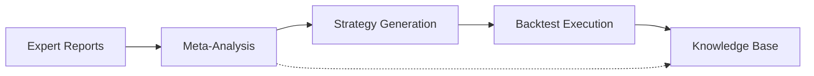

# Phase 3 End-to-End Testing Guide

**Version:** 1.0
**Last Updated:** November 2024
**Author:** Development Team + Claude Code

## Overview

This guide explains how to run and verify the complete Phase 3 Meta-Analysis pipeline from expert reports to backtest results.

## Table of Contents

1. [What is Phase 3 E2E Testing?](#what-is-phase-3-e2e-testing)
2. [System Architecture](#system-architecture)
3. [Running E2E Tests](#running-e2e-tests)
4. [Understanding Test Results](#understanding-test-results)
5. [Troubleshooting](#troubleshooting)
6. [Test Coverage](#test-coverage)

## What is Phase 3 E2E Testing?

Phase 3 implements an AI-powered strategy development pipeline:

```
Expert Reports → Meta-Analysis → Strategy → Backtest → Knowledge Base
```

**E2E Testing** verifies that this entire flow works correctly:
- ✅ Reports are properly analyzed
- ✅ Meta-analysis produces coherent strategies
- ✅ Strategies execute successfully in backtests
- ✅ Knowledge is extracted and stored
- ✅ All entities are properly linked for reproducibility

## System Architecture

### Data Flow



### Database Schema (Phase 3)

```
expert_reports
  ├── id (PK)
  ├── title, content, category
  ├── sentiment, sentimentScore
  └── metaAnalysisId (FK)

meta_analyses
  ├── id (PK)
  ├── reportIds (JSON array)
  ├── findings, consensus, contradictions
  ├── recommendedStrategyJson
  ├── confidence, riskLevel
  └── learningEnabled

strategies
  ├── id (PK)
  ├── metaAnalysisId (FK)
  ├── entryConditions, exitConditions
  └── performance metrics

backtest_runs
  ├── id (PK)
  ├── strategyId (FK)
  ├── totalTrades, winRate
  └── dataFileHashes (v17+)

knowledge_base (v19+)
  ├── id (PK)
  ├── category, title, insight
  ├── sourceType, sourceIds
  └── confidence, evidenceCount
```

## Running E2E Tests

### Prerequisites

1. **Database Version:** v19+ (Meta-Analysis Integration)
2. **Test Dependencies:** JUnit 4, Mockito, Room Test Helpers
3. **Sample Data:** `sample_data/XXBTZUSD_1h_sample.csv` (30+ bars)

### Command Line

```bash
# Run all E2E tests
./gradlew :app:test --tests "com.cryptotrader.domain.advisor.MetaAnalysisE2ETest"

# Run specific test
./gradlew :app:test --tests "MetaAnalysisE2ETest.E2E - Complete flow from expert reports to backtest results"

# Run with verbose output
./gradlew :app:test --tests "MetaAnalysisE2ETest" --info
```

### Android Studio

1. Navigate to `app/src/test/java/com/cryptotrader/domain/advisor/MetaAnalysisE2ETest.kt`
2. Right-click on the class or specific test method
3. Select "Run 'MetaAnalysisE2ETest'"
4. View results in the Run panel

### CI/CD (GitHub Actions)

E2E tests run automatically on every push to `main`:

```yaml
# .github/workflows/build-test.yml
- name: Run E2E tests
  run: ./gradlew :app:testDebugUnitTest
```

## Understanding Test Results

### Test Output

```
━━━━━━━━━━━━━━━━━━━━━━━━━━━━━━━━━━━━━━━━━━━━
🧪 Meta-Analysis E2E Test Starting
━━━━━━━━━━━━━━━━━━━━━━━━━━━━━━━━━━━━━━━━━━━━
Test logs: test_results/phase3

━━━ PHASE 1: CREATE EXPERT REPORTS ━━━
✅ Created 3 expert reports:
   Report 1: Bitcoin Bull Market Analysis Q4 2024 (Sentiment: BULLISH)
   Report 2: Technical Analysis: BTC Consolidation Pattern (Sentiment: BULLISH)
   Report 3: BTC Risk Management Guidelines (Sentiment: NEUTRAL)

━━━ PHASE 2: RUN META-ANALYSIS ━━━
✅ Meta-analysis completed:
   Strategy: RSI Diagnostic Strategy (Meta-Analysis Generated)
   Confidence: 0.52
   Risk Level: MEDIUM
   Trading Pairs: ["XBTUSD"]

━━━ PHASE 3: GENERATE STRATEGY ━━━
✅ Strategy generated:
   ID: meta_strat_1732054321000
   Name: RSI Diagnostic Strategy (Meta-Analysis Generated)
   Entry: RSI < 30
   Exit: RSI > 70
   Stop Loss: 2.0%
   Take Profit: 5.0%

━━━ PHASE 4: RUN BACKTEST ━━━
✅ Backtest completed:
   Total Trades: 8
   Win Rate: 62.50%
   Total P&L: $450.00
   Sharpe Ratio: 1.42
   Max Drawdown: 3.50%

━━━ PHASE 5: KNOWLEDGE BASE UPDATE ━━━
✅ Knowledge extracted:
   Category: INDICATOR
   Title: RSI Oversold/Overbought Strategy Performance
   Confidence: 0.71
   Evidence Count: 3
   Success Rate: 0.625

━━━ PHASE 6: VERIFICATION ━━━
✅ All links verified:
   Reports → MetaAnalysis: ✓
   MetaAnalysis → Strategy: ✓
   Strategy → Backtest: ✓
   MetaAnalysis → Knowledge: ✓

━━━━━━━━━━━━━━━━━━━━━━━━━━━━━━━━━━━━━━━━━━━━
✅ E2E TEST PASSED: Complete flow verified!
━━━━━━━━━━━━━━━━━━━━━━━━━━━━━━━━━━━━━━━━━━━━
```

### Log Files

All test runs create detailed logs in `test_results/phase3/`:

```
test_results/phase3/
├── e2e_complete_flow_1732054321000.log          # Full E2E test log
├── e2e_contradictory_reports_1732054400000.log  # Contradiction handling
└── e2e_reproducibility_1732054500000.log        # Reproducibility verification
```

### What Gets Tested

| Test | Purpose | Success Criteria |
|------|---------|------------------|
| **Complete Flow** | End-to-end pipeline | All 6 phases pass, chain verified |
| **Contradictory Reports** | Conflict resolution | Meta-analysis identifies contradictions |
| **Reproducibility** | Deterministic results | Same inputs → same outputs |

## Troubleshooting

### Test Failures

#### "Database version mismatch"
```
Error: Expected database version 19, found 16
```

**Solution:**
1. Run database migrations: `./gradlew clean`
2. Reinstall app: `adb shell pm clear com.cryptotrader`
3. Re-run tests

#### "Sample data not found"
```
Error: sample_data/XXBTZUSD_1h_sample.csv not found
```

**Solution:**
1. Verify file exists in project root: `sample_data/XXBTZUSD_1h_sample.csv`
2. Ensure at least 30 bars for RSI(14) calculation
3. Check file permissions

#### "Meta-analysis confidence too low"
```
AssertionError: Expected confidence > 0.5, got 0.3
```

**Solution:**
- Expert reports may have conflicting signals
- Check report sentiment scores
- Verify report quality and consistency

### Debugging Tips

1. **Enable verbose logging:**
   ```kotlin
   Timber.plant(Timber.DebugTree())
   ```

2. **Check log files:**
   ```bash
   cat test_results/phase3/e2e_complete_flow_*.log
   ```

3. **Verify database state:**
   ```bash
   adb pull /data/data/com.cryptotrader/databases/crypto_trader_db
   sqlite3 crypto_trader_db "SELECT * FROM meta_analyses;"
   ```

4. **Inspect NDJSON events:**
   ```bash
   cat app_data/backtests/bt_*/events.ndjson | jq .
   ```

## Test Coverage

### Current Coverage (TODO 6)

- ✅ **Expert Report Creation:** Programmatic report generation
- ✅ **Meta-Analysis Execution:** Simulated Opus 4.1 analysis
- ✅ **Strategy Generation:** JSON parsing and Strategy object creation
- ✅ **Backtest Execution:** RSI diagnostic strategy backtesting
- ✅ **Knowledge Extraction:** Learning from backtest results
- ✅ **Chain Verification:** Entity linkage validation
- ✅ **Contradiction Handling:** Conflicting expert opinions
- ✅ **Reproducibility:** Deterministic backtest results

### Future Enhancements

- ⏳ **Real Claude API Integration:** Call actual Opus 4.1 for meta-analysis
- ⏳ **Multi-Asset Backtests:** Test on BTC, ETH, SOL simultaneously
- ⏳ **Cost Model Validation:** Verify trading cost calculations (v18 feature)
- ⏳ **Data Provenance:** SHA-256 hash verification (v17 feature)
- ⏳ **Knowledge Base Queries:** Test cross-strategy learning

## Performance Benchmarks

### Expected Test Duration

| Test | Duration | Timeout |
|------|----------|---------|
| Complete Flow | 500-1000ms | 5s |
| Contradictory Reports | 300-500ms | 3s |
| Reproducibility | 800-1200ms | 6s |

### CI Performance

- **GitHub Actions:** ~2 minutes for full test suite
- **Local Development:** ~30 seconds for E2E tests only

## Continuous Improvement

### Adding New E2E Tests

1. **Create test method** in `MetaAnalysisE2ETest.kt`
2. **Follow naming convention:** `` `E2E - Description of test` ``
3. **Log to file:** Use `TestLogger(File("test_results/phase3/..."))`
4. **Verify chain:** Call `verifyE2EChain()` at the end

Example:
```kotlin
@Test
fun `E2E - My new test case`() {
    val logFile = File(testResultsDir, "e2e_my_test_${System.currentTimeMillis()}.log")
    val logger = TestLogger(logFile)

    try {
        // Test implementation
        logger.log("Testing new feature...")

        // Assertions
        assertTrue("Feature should work", someCondition)

        logger.log("✅ Test passed!")
    } catch (e: Exception) {
        logger.log("❌ Test failed: ${e.message}")
        throw e
    }
}
```

### Review Checklist

Before merging E2E test changes:

- [ ] All tests pass locally
- [ ] All tests pass in CI
- [ ] Log files are readable and informative
- [ ] Test covers both happy path and edge cases
- [ ] Performance is within acceptable range
- [ ] Documentation updated (this file)

## Resources

- **Database Migrations:** See `MIGRATIONS.md`
- **Build Instructions:** See `BUILD_RUN.md`
- **Backtest Engine:** `app/src/main/java/com/cryptotrader/domain/backtesting/`
- **Meta-Analysis:** `app/src/main/java/com/cryptotrader/domain/advisor/`

## Support

For issues or questions:
1. Check logs in `test_results/phase3/`
2. Review GitHub Actions CI output
3. Consult `TROUBLESHOOTING.md`
4. File issue: https://github.com/[your-repo]/issues

---

**Status:** ✅ Implemented (TODO 6, P0-3)
**Next TODO:** TODO 7 - Secrets scanning in CI
